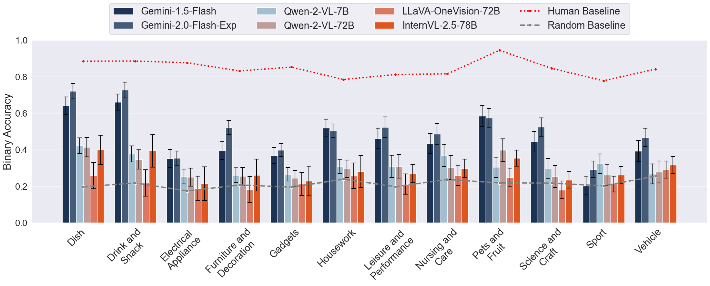
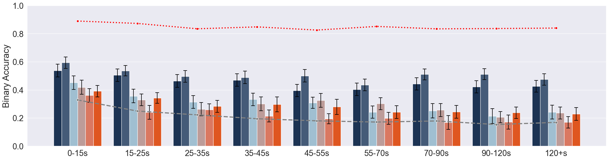
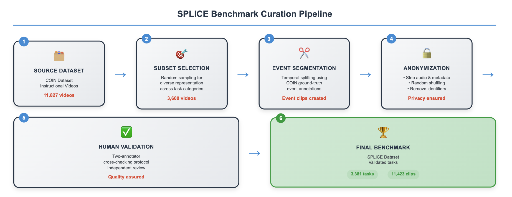

# Can you SPLICE it together? A Human Curated Benchmark for Probing Visual Reasoning in VLMs

[](https://aclanthology.org/2025.findings-emnlp.604/)
[](docs/Out_of_Order_MLLM_Thesis.pdf)
[](https://opensource.org/licenses/MIT)
[](https://huggingface.co/datasets/prokajevo/splice-benchmark)

This repository contains the official code for the paper **"Can you SPLICE it together? A Human Curated Benchmark for Probing Visual Reasoning in VLMs"**, published in Findings of EMNLP 2025. This work also formed the basis of the Master's thesis **"Out of Order: Evaluating MLLMs on Reordering Shuffled Video Segments, Temporal Logic, and Multimodal Event Understanding"** by Wilfred Okajevo, submitted in fulfillment of the requirements for the degree of Master of Science in Cognitive Science at Universitat Osnabruck.

This research confronts the "evaluation deficit" in video understanding by introducing a novel video segment reordering task. We present **SPLICE** (Sequential Processing for Learning and Inference in Chronological Events), a human-curated benchmark designed to rigorously test an MLLM's grasp of temporal logic, causality, and multimodal event structure, moving beyond simple classification to probe deep, structural reasoning.

---

## 📜 Abstract

The rapid advancement of Multimodal Large Language Models (MLLMs) has pushed capabilities into the complex domain of video understanding. However, current benchmarks often fail to robustly assess a model's grasp of temporal logic, being susceptible to linguistic shortcuts or focusing on simple classification. This paper introduces a novel evaluation methodology: a video segment reordering task instantiated through the **SPLICE** benchmark.

SPLICE is a human-curated benchmark derived from 3,381 instructional videos from the COIN dataset, segmented into 11,423 coherent event clips. Our extensive evaluation of leading MLLMs (including the Gemini and Qwen families) on SPLICE reveals a substantial performance gap. The best-performing model achieves a perfect sequence match accuracy of only **51%**, compared to a human baseline of approximately **85%**.

Crucially, results show that while textual annotations significantly improve model performance, they have no effect on human accuracy, indicating a strong reliance on language priors over genuine visual understanding in current MLLMs. This work not only quantifies the limitations of MLLMs but also validates the reordering task as a rigorous diagnostic tool for driving future progress in building more capable AI systems.

## 📊 Key Findings

1.  **Significant Human-Model Performance Gap**: Even state-of-the-art models lag significantly behind the human baseline of 84.9% binary accuracy. The best model, Gemini-2.0-Flash-Exp, scored 51.1%.

2.  **Over-reliance on Text**: Models show a dramatic performance increase when provided with text descriptions ("Video+Text" modality), while human performance remains unaffected. This suggests models use text as a "linguistic shortcut," bypassing deep visual reasoning.

3.  **Performance Degrades with Complexity**: Model accuracy drops sharply as the number of video segments to reorder increases, indicating a struggle with maintaining long-range temporal coherence. Humans exhibit a much more graceful degradation.

<p align="center">
  
  <br>
  <em>Binary accuracy versus the number of clip segments.</em>
</p>

4.  **Weakness in Contextual & Spatial Reasoning**: Models perform relatively well on tasks driven by clear causal/temporal logic ("Make" tasks, ~68%) but fail catastrophically on tasks requiring contextual reasoning ("Change/Replace" tasks, ~32%) due to a strong *Visual Similarity Bias*. Spatial reasoning remains a profound weakness.

<p align="center">
  
  <br>
  
  <br>
  <em>VLM performance across domains (top) and video durations (bottom).</em>
</p>

### Performance Summary

| Model                  | Vision Only (Binary) | Vision+Text (Binary) | Text Only (Binary) |
| ---------------------- | -------------------- | -------------------- | ------------------ |
| **Human Baseline**     | **0.8486**           | **0.8332**           | -                  |
| Gemini-2.0-Flash-Exp   | 0.5108               | 0.6939               | 0.5271             |
| Gemini-1.5-Flash       | 0.4599               | 0.5936               | 0.4642             |
| Qwen2-VL-72B           | 0.2990               | 0.5708               | 0.5402             |
| InternVL2.5-78B        | 0.2899               | 0.4856               | 0.4768             |
| LLaVA-OneVision-72B    | 0.2260               | 0.4256               | 0.4210             |
| **Random Baseline**    | **0.2114**           | **0.2114**           | -                  |

## 🗂️ The SPLICE Benchmark

The SPLICE benchmark is the core contribution of this work. It was created through a rigorous, multi-stage curation pipeline. **The full dataset is hosted on the [Hugging Face Hub](https://huggingface.co/datasets/prokajevo/splice-benchmark).**

<p align="center">
  
  <br>
  <em>The multi-stage SPLICE benchmark curation pipeline.</em>
</p>

-   **Source**: COIN Dataset (Comprehensive Instructional Video Analysis)
-   **Size**: 3,381 validated videos, 11,423 event clips
-   **Task**: Reorder a set of shuffled, anonymized video clips from a single event into their correct chronological sequence.
-   **Annotation**: Event-based segmentation based on ground-truth timestamps from COIN.
-   **Validation**: Each task was validated by human annotators to ensure solvability and remove ambiguity.

The benchmark is designed to probe five key dimensions of reasoning:
1.  **Temporal Reasoning**: Tracking object states across time.
2.  **Causal Reasoning**: Inferring cause-effect relationships.
3.  **Contextual Reasoning**: Understanding environmental and process dependencies.
4.  **Spatial Reasoning**: Interpreting trajectories and orientations.
5.  **Commonsense Reasoning**: Applying prior world knowledge.

## ⚙️ Repository Structure

```
.
├── gemini.py                   # Inference script for Gemini 1.5 Flash API
├── gemini2.py                  # Inference script for Gemini 2.0 Flash API
├── internVL.py                 # Inference script for InternVL 2.5
├── LlavaOnevision.py           # Inference script for LLaVA-OneVision
├── qwen2_vl.py                 # Inference script for Qwen2-VL
├── utils/
│   ├── __init__.py
│   ├── data_loader.py          # Shared data loading utilities
│   ├── evaluation.py           # Shared order extraction and accuracy computation
│   └── io.py                   # Shared CSV output utilities
├── assets/                     # Figures and plots for documentation
├── docs/
│   └── Out_of_Order_MLLM_Thesis.pdf   # Full Master's thesis
├── segment_metadata.json       # Metadata file with video paths and labels
└── requirements.txt            # Python dependencies
```

## 🚀 Getting Started

### 1. Installation

Clone the repository and install the required dependencies.

```bash
git clone https://github.com/prokajevo/OoOMLLM.git
cd OoOMLLM
pip install -r requirements.txt
```

### 2. Dataset

The SPLICE benchmark dataset is central to running these experiments. The `segment_metadata.json` file in this repository contains the paths and ground-truth information. The full dataset is available on the [Hugging Face Hub](https://huggingface.co/datasets/prokajevo/splice-benchmark).

Download the video clips and ensure the paths in `segment_metadata.json` correspond to their location on your local machine.

### 3. API Keys

For experiments involving the Gemini models, set your Google AI API key as an environment variable:

```bash
export GEMINI_API_KEY="your-api-key-here"
```

Alternatively, pass it directly via the `--api-key` flag when running gemini scripts.

## ▶️ Reproducing Experiments

All scripts accept command-line arguments for configuration:

```bash
# Common arguments for all scripts
--start     # Start index for dataset slice (default varies per script)
--end       # End index for dataset slice
--seed      # Random seed for reproducibility (default: 42)
--output    # Output CSV path
--metadata  # Path to segment_metadata.json
```

**Example: Running the LLaVA-OneVision experiment**

```bash
python LlavaOnevision.py --start 0 --end 100 --output results_llava.csv
```

**Example: Running the Gemini 2.0 Flash experiment**

```bash
export GEMINI_API_KEY="your-key"
python gemini2.py --start 0 --end 500 --output results_gemini2.csv
```

Each script will:
-   Load the segment data from `segment_metadata.json`.
-   For each video, load the shuffled clips.
-   Preprocess the video frames and construct the prompt.
-   Run inference to get the model's predicted order.
-   Save the results to a CSV file.

The same workflow applies to `internVL.py` and `qwen2_vl.py`. The Gemini scripts (`gemini.py`, `gemini2.py`) will additionally handle file uploads and API rate limiting.

## 📄 Thesis

The full Master's thesis, which provides extended methodology, analysis, and discussion beyond the conference paper, is available in this repository:

**[Out of Order: Evaluating MLLMs on Reordering Shuffled Video Segments, Temporal Logic, and Multimodal Event Understanding](docs/Out_of_Order_MLLM_Thesis.pdf)**

## 📖 Citation

If you use this work in your research, please cite:

```bibtex
@inproceedings{ballout-etal-2025-splice,
    title = "Can you {SPLICE} it together? A Human Curated Benchmark for Probing Visual Reasoning in {VLM}s",
    author = "Ballout, Mohamad and Wilfred, Okajevo and Yaghoubi, Seyedalireza and Abdelmoneim, Nohayr Muhammad and Mayer, Julius and Bruni, Elia",
    booktitle = "Findings of the Association for Computational Linguistics: EMNLP 2025",
    month = nov,
    year = "2025",
    address = "Suzhou, China",
    publisher = "Association for Computational Linguistics",
    url = "https://aclanthology.org/2025.findings-emnlp.604/",
    doi = "10.18653/v1/2025.findings-emnlp.604",
    pages = "11288--11309",
}
```

## 🙏 Acknowledgments

This repository provides the official code implementation accompanying the paper "Can you SPLICE it together? A Human Curated Benchmark for Probing Visual Reasoning in VLMs," published in the Findings of EMNLP 2025. This work originated from the Master's thesis of Wilfred Okajevo, "Out of Order: Evaluating MLLMs on Reordering Shuffled Video Segments, Temporal Logic, and Multimodal Event Understanding," submitted in fulfillment of the requirements for the degree of Master of Science in Cognitive Science at Universitat Osnabruck, under the supervision of Dr. Mohamad Ballout and Prof. Dr. Elia Bruni.
